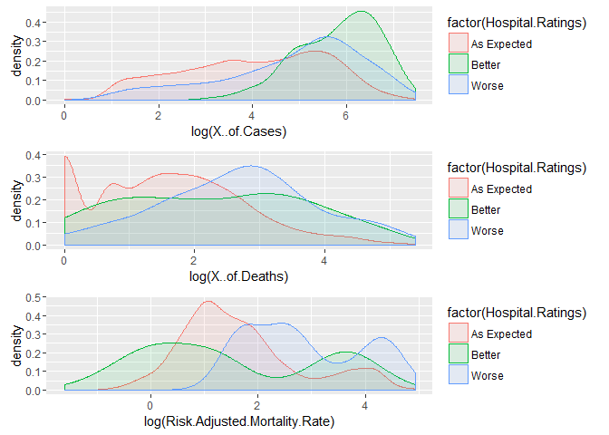
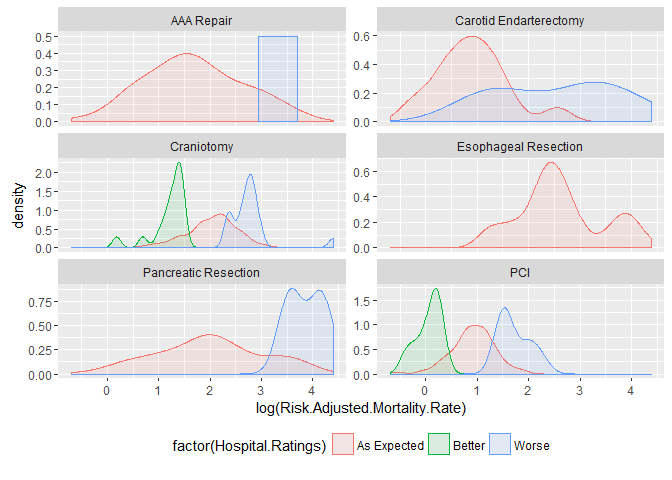
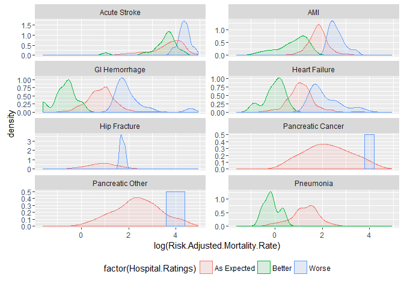
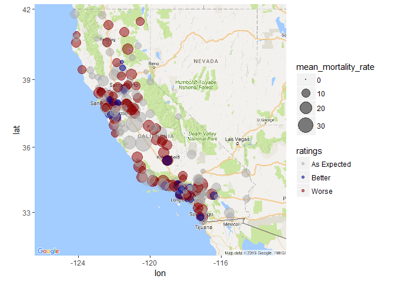
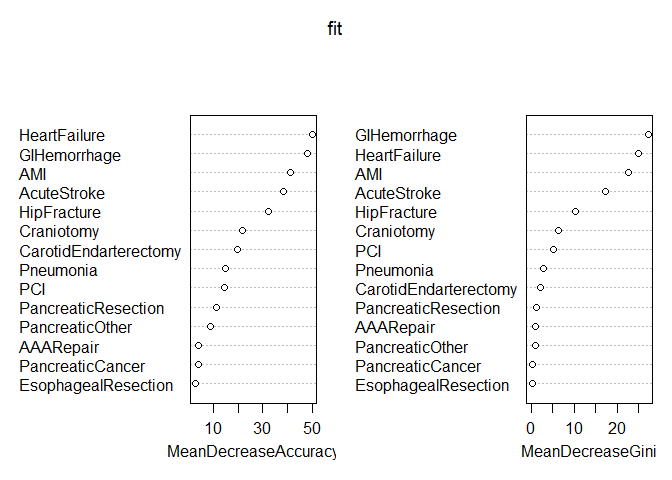
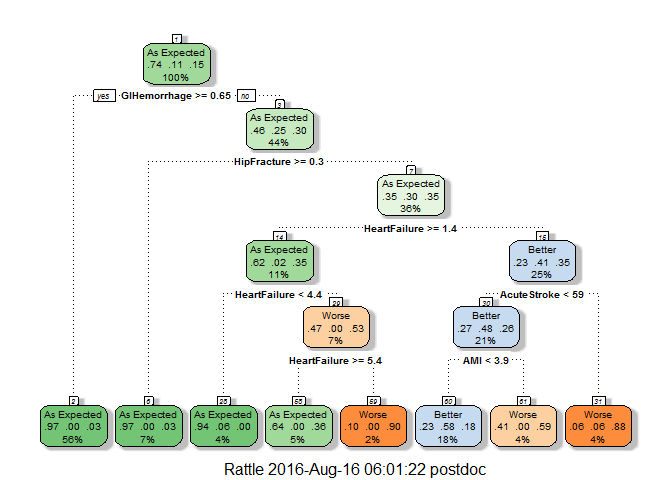
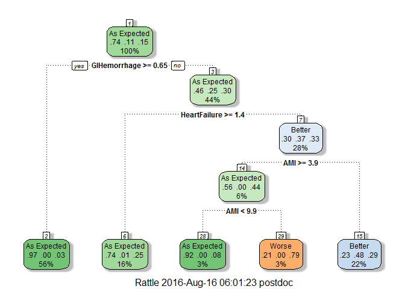
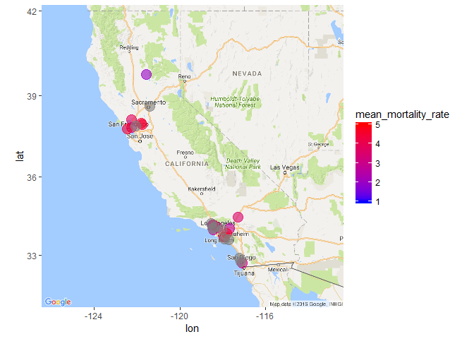
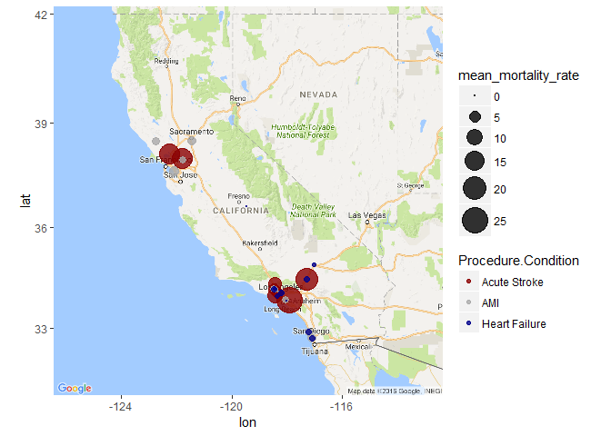
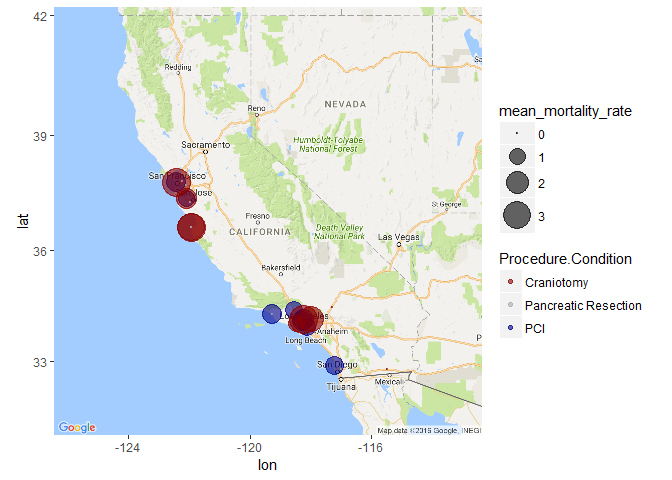

Introduction
------------

**Importance:** Using hospital quality ratings, patients are able to
make a better decision in what hospital they want to be treated and
where the best care is available in state of California, based on
overall hospital performance or based on particular medical condition or
procedure.

**Question:** Can we predict hospital quality ratings based on risk
adjusted mortality rates, number of deaths, number of cases, medical
procedures performed and medical conditions treated for 2012-2013?

Description of Data Set
-----------------------

**Dataset:** is available from [California Hospital Inpatient Mortality
Rates and Quality Ratings,
2012-2013](https://chhs.data.ca.gov/Healthcare/California-Hospital-Inpatient-Mortality-Rates-and-/rpkf-ugbp).

**Description of dataset:** The dataset contains risk-adjusted mortality
rates, and number of deaths and cases for 6 medical conditions treated
(Acute Stroke, Acute Myocardial Infarction, Heart Failure,
Gastrointestinal Hemorrhage, Hip Fracture and Pneumonia) and 6
procedures performed (Abdominal Aortic Aneurysm Repair, Carotid
Endarterectomy, Craniotomy, Esophageal Resection, Pancreatic Resection,
Percutaneous Coronary Intervention) in California hospitals for 2012 and
2013. This dataset does not include conditions treated or procedures
performed in outpatient settings.

Description, Analysis and Cleaning of Variables in the Data Set
---------------------------------------------------------------

**Load the data from csv file.**

    setwd("C:/Users/postdoc/Dropbox (Personal)/SpringBoard Fund/Rprojects/")
    data <- read.csv("California_Hospital_Inpatient_Mortality_Rates_and_Quality_Ratings__2012-2013.csv",sep=",",header=TRUE)
    df <- tbl_df(data)

**Dataset:** **11169** observations and **12** variables.

**Variables with missing values:**

-   Risk Adjusted Mortality Rate: The Risk Adjusted Mortality
    Rates (RAMR) presented here adjusts the observed mortality rates.
    This statistical methodology takes into account pre-existing health
    problems that put some patients at greater risk of death to level
    the playing field and allow fair comparisons across hospitals;
    **4754** missing values.
-   Number of Deaths: Number of patients that died in this hospital;
    **4926** missing values.
-   Number of Cases: Number of patients that had this medical procedure
    or condition in this hospital; **5004** missing values.

**Remove missing values, because number of missing values consists of
half of dataset.**

    df_clean <- df[which(is.na(df$X..of.Cases)==F),]

**Clean Dataset:** **6165** observations and **12** variables.

**Variables with no missing values:**

-   Year: **3100** values for 2012 year and **3065** values for
    2013 year.
-   County: **55** counties.
-   Hospital: **341** hospitals.
-   OSHPDID: A unique number established by the Office of Statewide
    Health Planning and Development (OSHPD) for identifying facilities
    and used in the Licensed Facility Information System (LFIS). The
    first three numbers identify the type of facility, the next two
    represent the county number, and the last five are randomly assigned
    within each county. 570261 unique codes.
-   Longitude: **Longitude** of hospital.
-   Latitude: **Latitude** of hospital.
-   location1: **333** levels.
-   Hospital Ratings: Comparison rating based on a 95% Confidence
    Interval (CI). If a hospitals upper CI is less than the statewide
    observed rate, it is designated as performing better than the
    average hospital. If a hospitals lower CI is greater than the state
    rate, it is designated as performing worse than the average
    state hospital. **3 levels of Hospital Ratings:** As Expected,
    Better and Worse.

<!-- -->

    summary(df_clean$Hospital.Ratings)

    ## As Expected      Better       Worse 
    ##        5797         158         210

-   Procedure.Condition: Procedure that was performed or condition that
    was treated. **6** medical **procedures** performed: Abdominal
    Aortic Aneurysm (AAA) Repair, Carotid Endarterectomy, Craniotomy,
    Esophageal Resection, Pancreatic Resection, Percutaneous
    Coronary Intervention. **6** medical **conditions** treated: Acute
    Stroke, Acute Myocardial Infarction, Heart Failure, Gastrointestinal
    Hemorrhage, Hip Fracture and Pneumonia. Clean dataset contains **17
    levels, instead of 12.**

<!-- -->

    summary(df_clean$Procedure.Condition)

    ##                AAA Repair              Acute Stroke 
    ##                       283                       617 
    ##  Acute Stroke Hemorrhagic     Acute Stroke Ischemic 
    ##                       466                       615 
    ## Acute Stroke Subarachnoid                       AMI 
    ##                       241                       590 
    ##    Carotid Endarterectomy                Craniotomy 
    ##                       404                       298 
    ##      Esophageal Resection             GI Hemorrhage 
    ##                        75                       622 
    ##             Heart Failure              Hip Fracture 
    ##                       616                       426 
    ##         Pancreatic Cancer          Pancreatic Other 
    ##                       142                       130 
    ##      Pancreatic Resection                       PCI 
    ##                       190                       299 
    ##                 Pneumonia 
    ##                       151

**Decoding Procedure.Condition variable.**

According to the American Stroke Association (ASA), strokes can be
classified into 2 main categories: **87%** are ischemic strokes, caused
by blockage of an artery; **13%** are hemorrhagic strokes, caused by
bleeding. Ischemic strokes are further divided into 2 groups: thrombotic
and embolic strokes. Hemorrhagic strokes are divided into 2 main
categories: intracerebral and subarachnoid hemorrhages.

Our clean dataset has four categories for Acute Stroke:

-   Acute Stroke: 617 observations;
-   Acute Stroke Hemorrhagic: 466 observations;
-   Acute Stroke Ischemic: 615 obervations;
-   Acute Stroke Subarachnoid: 241 observations.

Within each hospital, there are different notations for Acute Stroke
variable. It suggests that different doctor uses different notations for
the condition. These four categories are combined in one: Acute Stroke.

    df_clean$Procedure.Condition <- gsub("Acute Stroke .*","Acute Stroke",df_clean$Procedure.Condition)
    df_clean$Procedure.Condition <- factor(df_clean$Procedure.Condition)

Two additional categories are present in Procedure.Condition variable:

-   Pancreatic Cancer: 142 observations;
-   Pancreatic Other: 130 observations.

These categories are separate medical conditions and are not combined in
one category.

The Procedure.Condition variable contains 6 medical procedures and 8
medical conditions. To indicate what procedure was performed or what
condition was treated, the Medical\_Category variable was added to the
clean dataset.

    df_clean <- df_clean %>% 
      mutate(Medical_Category = ifelse(grepl("Repair",Procedure.Condition) | grepl("Endarterectomy",Procedure.Condition) | grepl("Craniotomy",Procedure.Condition) | grepl("Resection",Procedure.Condition) | grepl("PCI",Procedure.Condition),               "Procedure", "Condition"))

**Decoding Hospital.Ratings variable.**

    df_clean <- df_clean %>% mutate(ratings =
               ifelse(grepl("As Expected",Hospital.Ratings),"0",                        
               ifelse(grepl("Better",Hospital.Ratings),"1",
               ifelse(grepl("Worse",Hospital.Ratings),"-1",NA))))
    df_clean$ratings <- as.numeric(df_clean$ratings)

**Combine Acute Stroke repetitions for each hospital, so each hospital
has one unique value for Procedure.Condition variable.**

    df_clean_original <- df_clean
    df_clean <- df_clean %>% group_by(Year,Hospital,Procedure.Condition,
                                       Longitude,Latitude,Medical_Category) %>% 
                 summarise(ratings = sum(ratings), 
                           X..of.Deaths = sum(X..of.Deaths),
                           X..of.Cases = sum(X..of.Cases),
                           Risk.Adjusted.Mortality.Rate = sum(Risk.Adjusted.Mortality.Rate)) %>% 
                 mutate(Hospital.Ratings =
                           ifelse(ratings > 0,"Better",
                           ifelse(ratings < 0, "Worse","As Expected")))
    df_clean$Hospital.Ratings <- as.factor(df_clean$Hospital.Ratings)

Explanatory Data Analysis
-------------------------

**Density Plots for \# of Cases, \# of Deaths and Risk Adjusted
Mortality Rate by Hospital Ratings.**

    p1 <- ggplot(df_clean,aes(log(X..of.Cases),fill=factor(Hospital.Ratings),colour=factor(Hospital.Ratings)))+
      geom_density(alpha = 0.1)

    p2 <- ggplot(df_clean,aes(log(X..of.Deaths),fill=factor(Hospital.Ratings),colour=factor(Hospital.Ratings)))+
      geom_density(alpha = 0.1)

    p3 <- ggplot(df_clean,aes(log(Risk.Adjusted.Mortality.Rate),fill=factor(Hospital.Ratings),colour=factor(Hospital.Ratings)))+
      geom_density(alpha = 0.1)

    grid.arrange(p1, p2, p3, ncol=1)

**Conclusions 1:**

-   Distributions between 2012 and 2013 years look simiar (graphs are
    not shown).
-   There are no associations between variables for number of deaths and
    number of cases.
-   There is a possible **association** between the risk adjusted
    mortality rate and hospital ratings.
-   Lower the risk adjusted mortality rate, better the hospital ratings.
-   Higher the risk adjusted mortality rate, worse the hospital ratings.

**Density Plots for Risk Adjusted Mortality Rate by Procedures Performed
and Hospital Ratings.**

    df_p <- df_clean[which(df_clean$Medical_Category=="Procedure"),]

    p6 <- ggplot(df_p,aes(log(Risk.Adjusted.Mortality.Rate),fill=factor(Hospital.Ratings),colour=factor(Hospital.Ratings)))+
      geom_density(alpha = 0.1)+
      theme(legend.position='bottom')+
      facet_wrap(~ Procedure.Condition, ncol=2, scales="free_y")
    p6

-   The highest mortality rates are for Craniotomy and Pancreatic
    Resection procedures.  
-   Better and worst ratings are for Craniotomy and PCI procedures.
-   There is **association** between the risk adjusted mortality rate
    and hospital ratings.

**Density Plots for Risk Adjusted Mortality Rate by Conditions Treated
and Hospital Ratings.**

    df_c <- df_clean[which(df_clean$Medical_Category=="Condition"),]

    p9 <- ggplot(df_c,aes(log(Risk.Adjusted.Mortality.Rate),fill=factor(Hospital.Ratings),colour=factor(Hospital.Ratings)))+
      geom_density(alpha = 0.1)+
      theme(legend.position='bottom')+
      facet_wrap(~ Procedure.Condition, ncol=2, scales="free_y")
    p9

-   The highest mortality rates are for Acute Stroke, AMI and Heart
    Failure conditions.
-   Better and worse ratings are for Acute Stroke, AMI, GI Hemorrhage
    and Heart Failure conditions.
-   There is **association** between the risk adjusted mortality rate
    and hospital ratings.

### **Associations between medical procedures or conditions with hospital ratings, number of cases, number of deaths and risk adjusted mortality rate.**

**Procedures.**

    df_p_all <- df_p %>% 
      group_by(Procedure.Condition) %>% 
      summarise(all_cases = sum(X..of.Cases), 
                all_deaths = sum(X..of.Deaths),
                all_mortality_rate = sum(Risk.Adjusted.Mortality.Rate))
    df_p_all 

    ## # A tibble: 6 x 4
    ##      Procedure.Condition all_cases all_deaths all_mortality_rate
    ##                   <fctr>     <int>      <int>              <dbl>
    ## 1             AAA Repair      4927         59              508.5
    ## 2 Carotid Endarterectomy     12478         60              290.2
    ## 3             Craniotomy     30164       2159             2354.6
    ## 4   Esophageal Resection       619         28              436.9
    ## 5   Pancreatic Resection      3356         93             1002.8
    ## 6                    PCI     78660       2028              793.6

**Conditions.**

    df_c_all <- df_c %>% 
      group_by(Procedure.Condition) %>% 
      summarise(all_cases = sum(X..of.Cases), 
                all_deaths = sum(X..of.Deaths),
                all_mortality_rate = sum(Risk.Adjusted.Mortality.Rate))
    df_c_all

    ## # A tibble: 8 x 4
    ##   Procedure.Condition all_cases all_deaths all_mortality_rate
    ##                <fctr>     <int>      <int>              <dbl>
    ## 1        Acute Stroke    217956      20461            26582.9
    ## 2                 AMI     93594       5731             3863.4
    ## 3       GI Hemorrhage     94804       2099             1597.8
    ## 4       Heart Failure    155066       4778             2200.0
    ## 5        Hip Fracture     32245        744              945.8
    ## 6   Pancreatic Cancer      1787         43              632.0
    ## 7    Pancreatic Other      1425         41              590.0
    ## 8           Pneumonia     20630       1019              552.5

-   The highest number of cases is for PCI and Craniotomy procedures,
    Acute Stroke, Heart Failure, AMI and GI Hemorrhage conditions.
-   The highest number of deaths is for Craniotomy and PCI procedures,
    Acute Stroke, AMI and Heart Failure conditions.
-   The highest mortality rates are for Craniotomy and Pancreatic
    Resection procedures, Acute Stroke, AMI and Heart
    Failure conditions.

-   The lowest number of cases is for Esophageal Resection procedure,
    Pancreatic Cancer and Pancreatic Other conditions.
-   The lowest number of deaths is for Esophageal Resection procedure,
    Pancreatic Cancer and Pancreatic Other conditions.
-   The lowest mortality rates are for Carotid Endarterectomy procedure,
    Pancreatic Other and Pneumonia conditions.

**Hospital Ratings.**

    prop.table(table(df_clean$Procedure.Condition,df_clean$Hospital.Ratings))*100

    ##                         
    ##                          As Expected      Better       Worse
    ##   AAA Repair              5.80218873  0.00000000  0.04129672
    ##   Acute Stroke           10.81973983  1.01176956  0.90852777
    ##   AMI                    11.06752013  0.47491224  0.64009911
    ##   Carotid Endarterectomy  8.19739831  0.00000000  0.14453851
    ##   Craniotomy              5.40986992  0.37167045  0.37167045
    ##   Esophageal Resection    1.54862688  0.00000000  0.00000000
    ##   GI Hemorrhage          12.28577328  0.20648358  0.35102209
    ##   Heart Failure          11.48048730  0.47491224  0.76398926
    ##   Hip Fracture            8.71360727  0.00000000  0.08259343
    ##   Pancreatic Cancer       2.89077018  0.00000000  0.04129672
    ##   Pancreatic Other        2.64298988  0.00000000  0.04129672
    ##   Pancreatic Resection    3.84059467  0.00000000  0.08259343
    ##   PCI                     5.78154037  0.12389015  0.26842866
    ##   Pneumonia               3.03530869  0.08259343  0.00000000

-   Better ratings are for Craniotomy procedure, Acute Stroke, AMI and
    Heart Failure conditions.
-   Worse ragings are for Craniotomy and PCI procedures, Acute Stroke,
    AMI, GI Hemorrhage and Heart Failure conditions.  
-   As Expected ratings are for Acute Stroke, AMI, GI Hemorrhage and
    Heart Failure conditions.

**Conclusions 2:**

-   There is **association** between the risk adjusted mortality rate
    and hospital ratings.
-   Lower the risk adjusted mortality rate, better the hospital ratings.
-   Higher the risk adjusted mortality rate, worse the hospital ratings.

-   **Procedures**:
    -   with severe outcomes: PCI, Craniotomy and Pancreatic Resection.
    -   with good outcomes: Esophageal Resection and
        Carotid Endarterectomy.
-   **Conditions**:
    -   with severe outcomes: Acute Stroke, AMI, Heart Failure and
        GI Hemorrhage.
    -   with good outcomes: Pancreatic Cancer, Pancreatic Other
        and Pneumonia.

### **Mapping and summary** of overall hospital quality ratings and mean mortality rate among all conditions and procedures.

**Summary of hospital ratings over all conditions and procedues.**

    all_ratings <- df_clean %>% 
                    group_by(Hospital,Latitude,Longitude) %>% 
                    summarise(all_ratings = 0.5 * sum(ratings), # 0.5 to account for 2012 and 2013
                              mean_mortality_rate = mean(Risk.Adjusted.Mortality.Rate)) %>% 
                    mutate(ratings =
                             ifelse(all_ratings > 0,"Better",
                             ifelse(all_ratings < 0, "Worse","As Expected")))
    all_ratings$ratings <- as.factor(all_ratings$ratings)
    all_ratings <- tbl_df(all_ratings)

**Mapping of overall hospital ratings and mean mortality rates.**

    CAmap <- get_map(location="California",source="google",maptype="roadmap",crop=FALSE,zoom=6) 
    ggmap (CAmap) +
      geom_point(aes(x=Longitude,y=Latitude,size=mean_mortality_rate,colour=ratings),data=all_ratings,alpha=0.5)+
      scale_colour_manual(values=c("Worse" = "darkred","Better" = "darkblue","As Expected" = "darkgrey"))+
      scale_size(range = c(0, 10))

**Overall Hospital Ratings:**

    summary(all_ratings$ratings)

    ## As Expected      Better       Worse 
    ##         172          69          99

-   Top 5 hospitals with the **best** quality ratings:

<!-- -->

    all_ratings %>% arrange(desc(all_ratings)) %>% select(Hospital) %>% slice(1:5)

    ## # A tibble: 5 x 1
    ##                                      Hospital
    ##                                        <fctr>
    ## 1 Kaiser Foundation Hospital – Redwood City
    ## 2       Kaiser Foundation Hospital – Sunset
    ## 3           Centinela Hospital Medical Center
    ## 4                      Scripps Green Hospital
    ## 5                 Cedars Sinai Medical Center

-   Top 5 hospitals with the **lowest** mean mortality rate:

<!-- -->

    all_ratings %>% arrange(mean_mortality_rate) %>% select(Hospital) %>% slice(1:5)

    ## # A tibble: 5 x 1
    ##                                     Hospital
    ##                                       <fctr>
    ## 1                 Corcoran District Hospital
    ## 2 Eastern Plumas Hospital – Portola Campus
    ## 3                       Glenn Medical Center
    ## 4    Good Samaritan Hospital – Bakersfield
    ## 5                  Hoag Orthopedic Institute

-   Top 5 hospitals with the **worst** quality ratings:

<!-- -->

    all_ratings %>% arrange(all_ratings) %>% select(Hospital) %>% slice(1:5)

    ## # A tibble: 5 x 1
    ##                                                              Hospital
    ##                                                                <fctr>
    ## 1                                      Palomar Health Downtown Campus
    ## 2 Los Angeles County/University of Southern California Medical Center
    ## 3                                      San Francisco General Hospital
    ## 4                                      Santa Barbara Cottage Hospital
    ## 5                                   Arrowhead Regional Medical Center

-   Top 5 hospitals with the **highest** mean mortality rate:

<!-- -->

    all_ratings %>% arrange(desc(mean_mortality_rate)) %>% select(Hospital)  %>% slice(1:5)

    ## # A tibble: 5 x 1
    ##                             Hospital
    ##                               <fctr>
    ## 1        Memorial Hospital Los Banos
    ## 2  Central Valley Specialty Hospital
    ## 3   Coalinga Regional Medical Center
    ## 4 Santa Ynez Valley Cottage Hospital
    ## 5    Biggs Gridley Memorial Hospital

### **Summary** of hospital quality ratings and mortality rates for Acute Stroke, AMI and Heart Failure **conditions**, PCI, Craniotomy and Pancreatic Resection **procedures**.

    df_as <- df_c[which(df_c$Procedure.Condition=="Acute Stroke"),]

    df_as_all <- df_as %>% 
                    group_by(Hospital,Latitude,Longitude) %>% 
                    summarise(all_ratings = 0.5 * sum(ratings), # to account for 2012 and 2013 
                              mean_mortality_rate = mean(Risk.Adjusted.Mortality.Rate)) %>% 
                    mutate(ratings =
                             ifelse(all_ratings > 0,"Better",
                             ifelse(all_ratings < 0, "Worse","As Expected")),
                           Procedure.Condition="Acute Stroke")

    df_as_all$ratings <- as.factor(df_as_all$ratings)
    df_as_all <- tbl_df(df_as_all)

    df_as_best_rat <- df_as_all %>% arrange(desc(all_ratings)) %>% slice(1:50)
    df_as_best <- df_as_best_rat %>% arrange(mean_mortality_rate) %>% slice(1:25)

**Top 5 hospitals for treatment of Acute Stroke condition.**

    df_as_best %>% slice(1:5) %>% select(Hospital)

    ## # A tibble: 5 x 1
    ##                                                Hospital
    ##                                                  <fctr>
    ## 1                 Pacific Alliance Medical Center, Inc.
    ## 2                              Anaheim General Hospital
    ## 3                                Olympia Medical Center
    ## 4                        Encino Hospital Medical Center
    ## 5 Los Angeles County/Olive View – UCLA Medical Center

**Top 5 hospitals for treatment of AMI condition.**

    ## # A tibble: 5 x 1
    ##                                    Hospital
    ##                                      <fctr>
    ## 1 Southern California Hospital at Hollywood
    ## 2                     Sherman Oaks Hospital
    ## 3    Kaiser Foundation Hospital – Antioch
    ## 4            Encino Hospital Medical Center
    ## 5          La Palma Intercommunity Hospital

**Top 5 hospitals for treatment of Heart Failure condition.**

    ## # A tibble: 5 x 1
    ##                               Hospital
    ##                                 <fctr>
    ## 1 Adventist Medical Center – Reedley
    ## 2             Anaheim General Hospital
    ## 3                Sherman Oaks Hospital
    ## 4           Barstow Community Hospital
    ## 5    Centinela Hospital Medical Center

**Top 5 hospitals to perform the PCI procedure.**

    ## # A tibble: 5 x 1
    ##                               Hospital
    ##                                 <fctr>
    ## 1               Brotman Medical Center
    ## 2   Fresno Heart and Surgical Hospital
    ## 3                   El Camino Hospital
    ## 4       Downey Regional Medical Center
    ## 5 Henry Mayo Newhall Memorial Hospital

**Top 5 hospitals to perform the Craniotomy procedure.**

    ## # A tibble: 5 x 1
    ##                            Hospital
    ##                              <fctr>
    ## 1                 Alhambra Hospital
    ## 2            Desert Valley Hospital
    ## 3 El Centro Regional Medical Center
    ## 4      Saint John’s Health Center
    ## 5                El Camino Hospital

**Top 5 hospitals to perform the Pancreatic Resection procedure.**

    ## # A tibble: 5 x 1
    ##                                           Hospital
    ##                                             <fctr>
    ## 1                    Alameda County Medical Center
    ## 2            Community Hospital Monterey Peninsula
    ## 3     Community Hospital of The Monterey Peninsula
    ## 4 Community Memorial Hospital – San Buenaventura
    ## 5                              Eden Medical Center

### **Predictions**

**Approach**

-   Predict hospital quality ratings using **random forests and
    classification decision trees**.
-   Train the models and evaluate the model performances on 2012
    training data.
-   Test the model performances on 2013 test data.

#### Hospital Ratings Prediction Using Random Forests for Dataset in **Wide** Format.

**Cleanning the Data Set and converting to the wide format based on
Procedure.Condition and Risk.Adjusted.Mortality.Rate variables.**

    # convert data to the wide format
    df_wide <- df_clean %>% select(Year,Hospital,Latitude,Longitude,Procedure.Condition,Hospital.Ratings,Risk.Adjusted.Mortality.Rate) %>% spread(Procedure.Condition,Risk.Adjusted.Mortality.Rate) 
    # remove white spaces from column names
    colnames(df_wide) <- gsub(" ","",colnames(df_wide))
    # replace NA with 0, because some hospitals does not treat these conditions, thus mortality rate is zero. 
    df_wide[is.na(df_wide)] <- 0

**Split the Data Set into 2012 training and 2013 test sets.**

    train_wide <- df_wide[which(df_wide$Year==2012),]
    test_wide_original <- df_wide[which(df_wide$Year==2013),]
    test_wide <- subset(test_wide_original, select = -Hospital.Ratings)

**Feature Enginering with Random Forests**

    fit <- randomForest(Hospital.Ratings ~ AAARepair + AcuteStroke + AMI + CarotidEndarterectomy + Craniotomy + EsophagealResection + GIHemorrhage + HeartFailure + HipFracture + PancreaticCancer + PancreaticOther + PancreaticResection + PCI + Pneumonia, data=train_wide,importance=TRUE,ntree=1000)
    varImpPlot(fit)

-   **The most important variables are** Heart Failure, GI Hemorrhage,
    AMI and Acute Stroke, Hip Fracture **conditions**;
-   **Procedure** variables are less important and thus are not included
    in classification.

**Model performance** on **train\_wide** dataset using all variables.

    # confusion matrix on train data
    fit$confusion 

    ##             As Expected Better Worse class.error
    ## As Expected         298     18    10  0.08588957
    ## Better                9     36     2  0.23404255
    ## Worse                25      5    35  0.46153846

-   Accuracy (how often is the classifier correct): 0.8409653
-   Error Rate (how often is the classifier wrong): 0.1590347

**Predictions** on **test\_wide** dataset using all variables.

    prediction <- predict(fit, test_wide)
    # confusion matrix on test data
    cm <- as.matrix(table(Actual = test_wide_original$Hospital.Ratings,Predicted = prediction))
    cm 

    ##              Predicted
    ## Actual        As Expected Better Worse
    ##   As Expected         290     21    13
    ##   Better                7     39     5
    ##   Worse                27      0    41

    rf_a <- sum(diag(cm))/sum(cm)
    rf_e <- 1 - sum(diag(cm))/sum(cm)

-   Accuracy: 0.8352144
-   Error Rate: 0.1647856

#### Hospital Ratings Prediction Using Classification Decision Trees (CART).

**Model 1: All variables are included in tree construction.**

    set.seed(34)
    tree0 <- rpart(Hospital.Ratings ~ AAARepair + AcuteStroke + AMI + CarotidEndarterectomy + Craniotomy + EsophagealResection + GIHemorrhage + HeartFailure + HipFracture + PancreaticCancer + PancreaticOther + PancreaticResection + PCI + Pneumonia, data = train_wide, method = "class",control=rpart.control(cp=0.001)) 
    printcp(tree0)

    ## 
    ## Classification tree:
    ## rpart(formula = Hospital.Ratings ~ AAARepair + AcuteStroke + 
    ##     AMI + CarotidEndarterectomy + Craniotomy + EsophagealResection + 
    ##     GIHemorrhage + HeartFailure + HipFracture + PancreaticCancer + 
    ##     PancreaticOther + PancreaticResection + PCI + Pneumonia, 
    ##     data = train_wide, method = "class", control = rpart.control(cp = 0.001))
    ## 
    ## Variables actually used in tree construction:
    ## [1] AcuteStroke  AMI          Craniotomy   GIHemorrhage HeartFailure
    ## [6] HipFracture 
    ## 
    ## Root node error: 112/438 = 0.25571
    ## 
    ## n= 438 
    ## 
    ##          CP nsplit rel error  xerror     xstd
    ## 1 0.0595238      0   1.00000 1.00000 0.081520
    ## 2 0.0357143      5   0.60714 0.70536 0.071847
    ## 3 0.0089286      7   0.53571 0.63393 0.068866
    ## 4 0.0059524      8   0.52679 0.67857 0.070763
    ## 5 0.0010000     11   0.50893 0.67857 0.070763

    num <- which.min(tree0$cptable[,"xerror"])
    tree0$cptable[num,]

    ##          CP      nsplit   rel error      xerror        xstd 
    ## 0.008928571 7.000000000 0.535714286 0.633928571 0.068866360

    cp.choice<-tree0$cptable[num,"CP"]
    pruned.tree<-prune(tree0, cp=cp.choice)
    fancyRpartPlot(pruned.tree)

**Predictions** on **test\_wide** dataset.

    # Make predictions on the test set
    prediction <- predict(pruned.tree, test_wide, type = "class")
    # confusion matrix
    cm <- as.matrix(table(Actual = test_wide_original$Hospital.Ratings,Predicted = prediction))
    cm

    ##              Predicted
    ## Actual        As Expected Better Worse
    ##   As Expected         287     24    13
    ##   Better                4     44     3
    ##   Worse                26     13    29

    call_a <- sum(diag(cm))/sum(cm)
    call_e <- 1 - sum(diag(cm))/sum(cm)

-   Accuracy: 0.8126411
-   Error Rate: 0.1873589

**Model 2: AMI, GIHemorrhage and HeartFailure variables are included in
tree construction.**

    tree1 <- rpart(Hospital.Ratings ~ AMI + GIHemorrhage + HeartFailure, data = train_wide, method = "class",control=rpart.control(cp=0.001)) # cp determines when the splitting up of the decision tree stops
    printcp(tree1)

    ## 
    ## Classification tree:
    ## rpart(formula = Hospital.Ratings ~ AMI + GIHemorrhage + HeartFailure, 
    ##     data = train_wide, method = "class", control = rpart.control(cp = 0.001))
    ## 
    ## Variables actually used in tree construction:
    ## [1] AMI          GIHemorrhage HeartFailure
    ## 
    ## Root node error: 112/438 = 0.25571
    ## 
    ## n= 438 
    ## 
    ##          CP nsplit rel error  xerror     xstd
    ## 1 0.0714286      0   1.00000 1.00000 0.081520
    ## 2 0.0267857      4   0.71429 0.76786 0.074228
    ## 3 0.0089286      6   0.66071 0.80357 0.075502
    ## 4 0.0044643      7   0.65179 0.86607 0.077590
    ## 5 0.0010000      9   0.64286 0.85714 0.077303

    num <- which.min(tree1$cptable[,"xerror"])
    tree1$cptable[num,]

    ##         CP     nsplit  rel error     xerror       xstd 
    ## 0.02678571 4.00000000 0.71428571 0.76785714 0.07422761

    cp.choice<-tree1$cptable[num,"CP"]
    pruned.tree1<-prune(tree1, cp=cp.choice)
    fancyRpartPlot(pruned.tree1)

**Predictions** on **test\_wide** dataset.

    # Make predictions on the test set
    prediction <- predict(pruned.tree1, test_wide, type = "class")
    # confusion matrix
    cm <- as.matrix(table(Actual = test_wide_original$Hospital.Ratings,Predicted = prediction))
    cm

    ##              Predicted
    ## Actual        As Expected Better Worse
    ##   As Expected         292     27     5
    ##   Better                5     46     0
    ##   Worse                29     30     9

    c3_a <- sum(diag(cm))/sum(cm)
    c3_e <- 1 - sum(diag(cm))/sum(cm)

-   Accuracy: 0.7832957
-   Error Rate: 0.2167043

**Conclusions 3:**

-   **Accuracy on the test data set using**
    -   Random Forests with all variables: 0.8352
    -   CART with all variables: 0.8126
    -   CART with three variables: 0.7833
-   **Random forests** gives the best performance, however is not good
    enough to predict hospitals with the best care in future.
-   **Random forests** predicts that classification of **hospital
    ratings** depend on **conditions and not procedures** with the most
    severe patient outcomes.

### **Future Work**

-   Predict hospital quality ratings using **multinomial logistic
    regression**.
    -   Train the model and evaluate the model performance on 2012
        training data.
    -   Test the model performance on 2013 test data.
-   Compare three models: random forests, classification decision trees
    and multinomial logistic regression.
    -   Summarize which model gives the best performance on 2012
        training data and on 2013 test data.
    -   Choose the best model and test its performance on [2014 test
        data](http://oshpd.ca.gov/HID/Products/PatDischargeData/AHRQ/iqi-imi_overview.html).
-   Recommend which hospitals will have the best care in future using
    predicted hospital ratings.

### **Recommendations to Patients**

### Top 25 hospitals with the best overall ratings and the lowest mean mortality rate in state of California.

    best_ratings <- all_ratings %>% arrange(desc(all_ratings)) %>% slice(1:50)
    best_lowest <- best_ratings %>% arrange(mean_mortality_rate) %>% slice(1:25)
    # best_lowest$Hospital[duplicated(best_lowest$Hospital)]

    CAmap <- get_map(location="California",source="google",maptype="roadmap",crop=FALSE,zoom=6) 
    ggmap (CAmap) +
      geom_point(aes(x=Longitude,y=Latitude,colour=mean_mortality_rate),data=best_lowest,size=5,alpha=0.6)+
      scale_colour_gradient(limits=c(1, 5), high="red", low="blue")

**Top 5 hospitals with the best overall ratings and the lowest mean
mortality rate in state of California.**

    best_lowest$Hospital[1:5]

    ## [1] Encino Hospital Medical Center Feather River Hospital        
    ## [3] Chino Valley Medical Center    Marina Del Rey Hospital       
    ## [5] Paradise Valley Hospital      
    ## 341 Levels: Adventist Medical Center ...

### Top hospitals with the best ratings and the lowest mean mortality rate for Acute Stroke, AMI and Heart Failure **conditions**.

    best_cond <- bind_rows(df_as_best[1:10,],df_ami_best[1:10,],df_hf_best[1:10,])

    CAmap <- get_map(location="California",source="google",maptype="roadmap",crop=FALSE,zoom=6) 
    ggmap (CAmap) +
      geom_point(aes(x=Longitude,y=Latitude,size=mean_mortality_rate,colour=Procedure.Condition),data=best_cond,alpha=0.8)+
      scale_colour_manual(values=c("Acute Stroke"="darkred", "AMI"="darkgrey", "Heart Failure"="darkblue"))+
      scale_size(range = c(0, 10))

**There are 7 hospitals that have the best ratings and the lowest
mortality rate for the most severe conditions.**

    best_cond$Hospital[duplicated(best_cond$Hospital)]

    ## [1] Encino Hospital Medical Center Anaheim General Hospital      
    ## [3] Sherman Oaks Hospital          Encino Hospital Medical Center
    ## [5] Desert Valley Hospital         Paradise Valley Hospital      
    ## [7] Scripps Green Hospital        
    ## 341 Levels: Adventist Medical Center ...

### Top hospitals with the best ratings and the lowest mean mortality rate for PCI, Craniotomy and Pancreatic Resection **procedures**.

    best_proc <- bind_rows(df_pci_best[1:10,],df_cr_best[1:10,],df_pr_best[1:10,])

    CAmap <- get_map(location="California",source="google",maptype="roadmap",crop=FALSE,zoom=6) 
    ggmap (CAmap) +
      geom_point(aes(x=Longitude,y=Latitude,size=mean_mortality_rate,colour=Procedure.Condition),data=best_proc,alpha=0.6)+
      scale_colour_manual(values=c("PCI"="darkblue", "Craniotomy"="darkred", "Pancreatic Resection"="darkgrey"))+
      scale_size(range = c(0, 10))

**There are 7 hospitals that have the best ratings and the lowest
mortality rate for the most severe procedures.**

    best_proc$Hospital[duplicated(best_proc$Hospital)]

    ## [1] El Camino Hospital                                  
    ## [2] California Pacific Medical Center – Pacific Campus
    ## [3] Glendale Adventist Medical Center – Wilson Terrace
    ## [4] Community Hospital Monterey Peninsula               
    ## [5] Community Hospital of The Monterey Peninsula        
    ## [6] Community Memorial Hospital – San Buenaventura    
    ## [7] Fresno Heart and Surgical Hospital                  
    ## 341 Levels: Adventist Medical Center ...
